# CareerConnect Job Fair 2026

A single-page application (SPA) for a three-day job fair in Kuala Lumpur.

Built with **Vue 3 + TypeScript + Vite** (front end) and **PHP + MySQL** (back end).

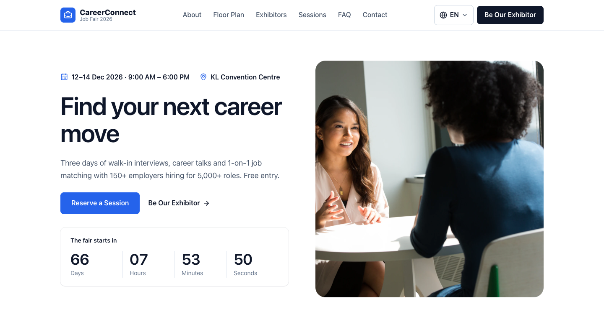

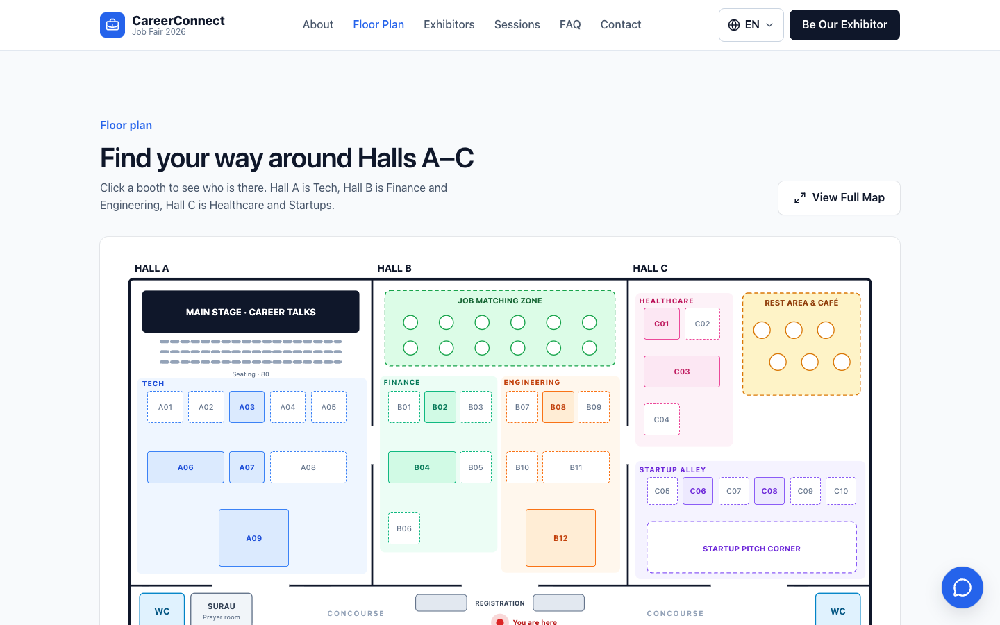

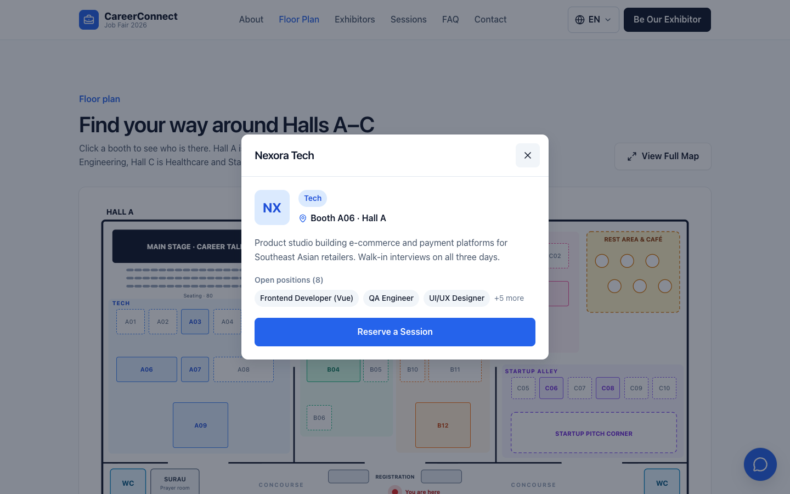

<details>
<summary>More screenshots</summary>

**About**

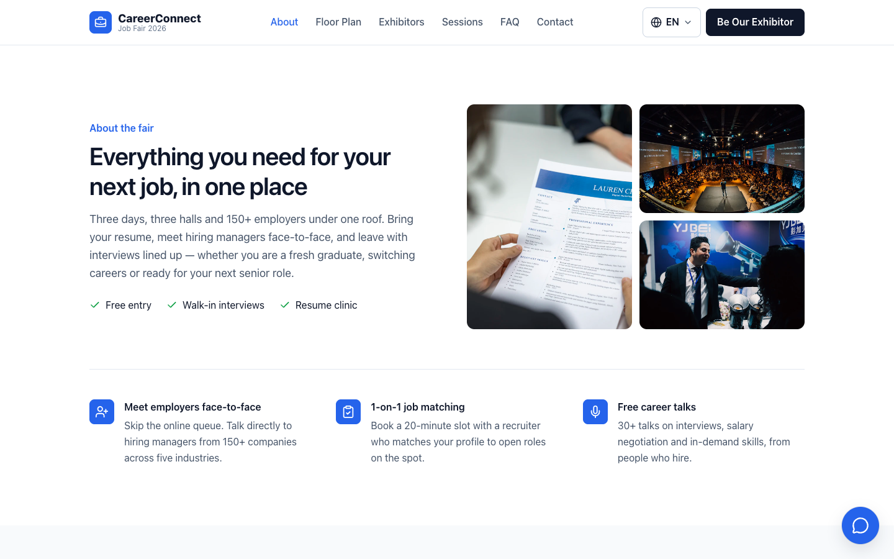

**Exhibitor directory**

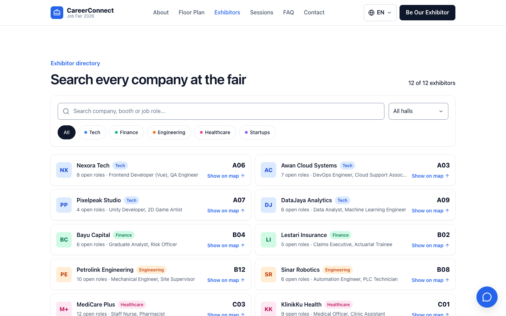

**Sessions**

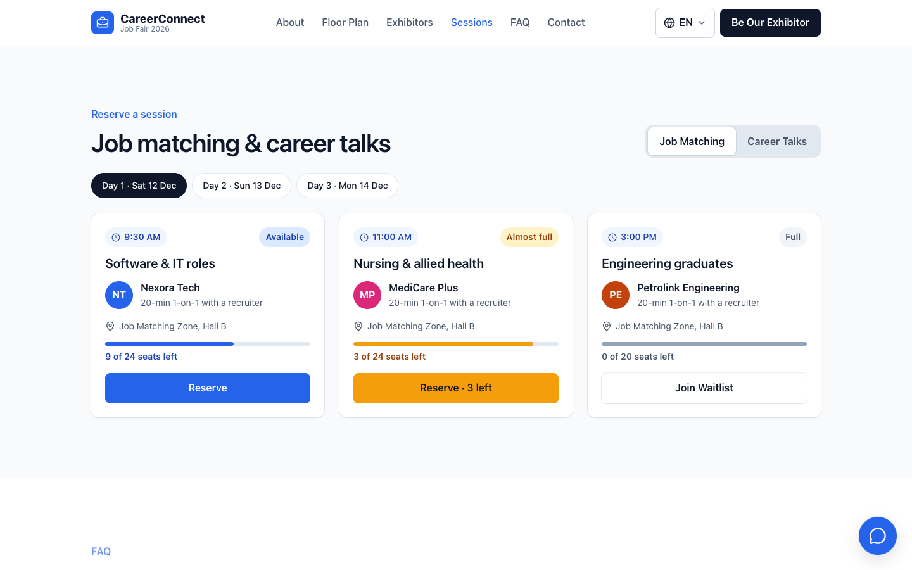

**Reserve a session**

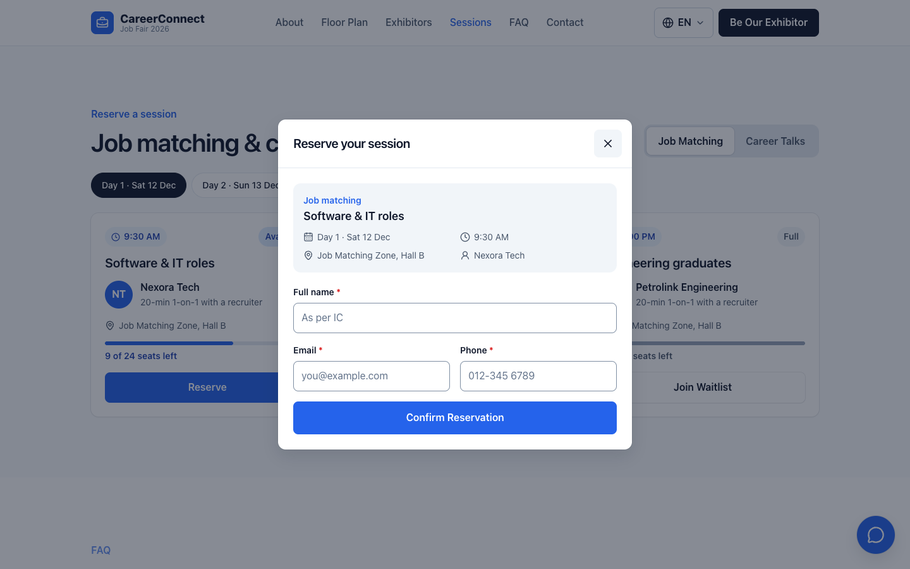

**Be Our Exhibitor**

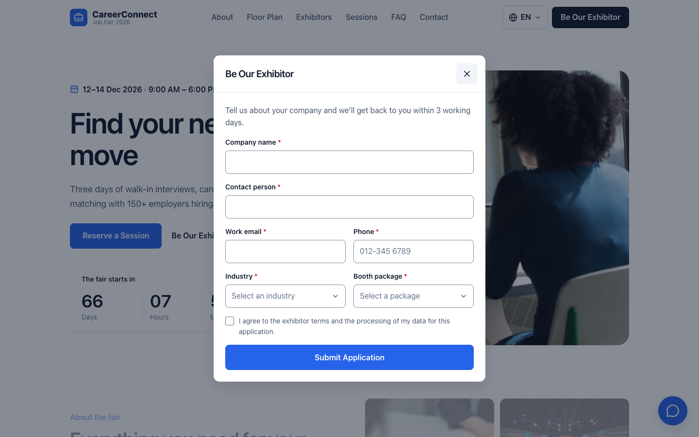

**FAQ**

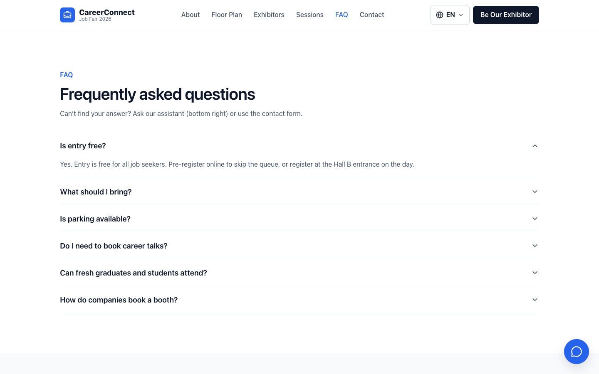

**Contact**

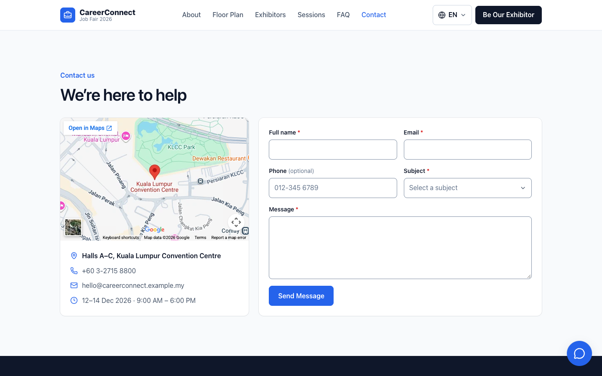

**Chatbot**

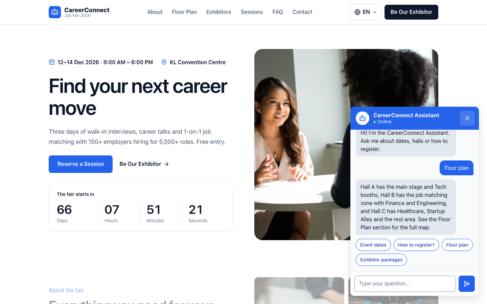

</details>

<details>
<summary>Show the full page</summary>

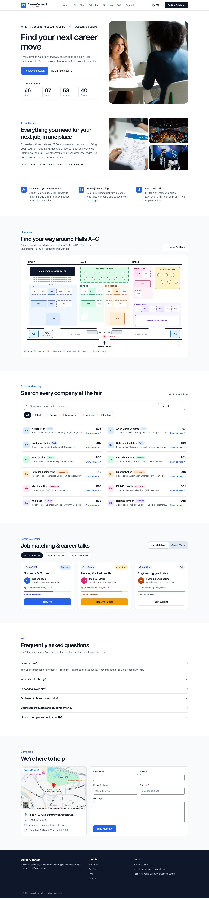

</details>

## Features

- Floor plan with clickable booths and a zoomable full map
- Exhibitor directory with search and filters
- Session reservations for job matching and career talks
- "Be Our Exhibitor" registration form
- Contact form
- Chatbot for visitor and exhibitor questions (Groq API)
- Countdown to the fair
- English and Bahasa Melayu
- Responsive layout with animations

All forms are checked in the browser and again in PHP before being saved to MySQL.

## Requirements

- Node.js 22.18+ and pnpm
- PHP 8+ with the `pdo_mysql` and `curl` extensions
- MySQL
- A free Groq API key from [console.groq.com](https://console.groq.com)

## Setup

**1. Install packages**

```sh
pnpm install
```

**2. Create the database**

```sh
mysql -u root -p -e "CREATE DATABASE job_fair"
mysql -u root -p job_fair < database/schema.sql
```

**3. Add your settings**

```sh
cp backend/config.example.php backend/config.php
```

Open `backend/config.php` and fill in your MySQL login, your Groq API key and a Groq model name. This file is in `.gitignore`, so it is never committed.

## Run

Start the PHP server and the website in two terminals:

```sh
php -S localhost:8000 -t backend
```

```sh
pnpm dev
```

Then open [http://localhost:5173](http://localhost:5173).

## How it works

The Vue app sends form and chat requests to `/api`. Vite forwards them to the PHP server, which saves the data to MySQL or asks the Groq API for a chat reply.

| Endpoint | Method | What it does |
| --- | --- | --- |
| `/api/contact.php` | POST | Saves a contact message |
| `/api/exhibitor.php` | POST | Saves an exhibitor application |
| `/api/reserve.php` | POST | Saves a session reservation |
| `/api/chat.php` | POST | Sends a chat message to Groq and returns the reply |

## Project structure

```
backend/api/     PHP endpoints for the forms and chatbot
database/        MySQL tables (schema.sql)
src/components/  One file per page section
src/data/        Dummy exhibitors and sessions
src/locales/     Page text in English (en.json) and Malay (ms.json)
```

## Notes

- Exhibitors and sessions are dummy data. Photos are from [Unsplash](https://unsplash.com).
- The Groq free plan allows only a few chat messages per minute.
